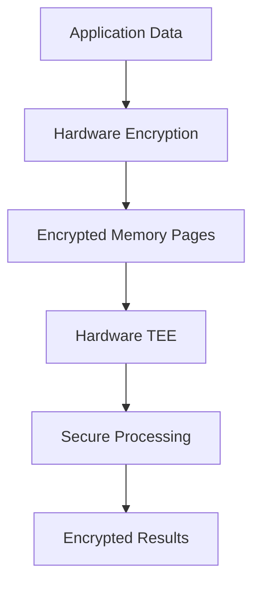

## Understanding Confidentiality in Tinfoil

Tinfoil's isolation technology provides significantly stronger data protection than traditional cloud solutions. Our enclaves create true hardware-level isolation, ensuring your sensitive data remains protected from all parties - including us.

<Note>
Your data stays encrypted end-to-end by hardware-level safeguards and is never accessible to anyone other than you — not even to Tinfoil.
</Note>

## How It Works

### Hardware-Level Isolation

<AccordionGroup>
  <Accordion icon="microchip" title="Trusted Execution Environments (TEEs)">
    TEEs create an architecturally-isolated bare metal environment inside the server. This provides:
    - Complete separation from the host operating system
    - Protection from cloud infrastructure access
    - Isolation from other processes and applications
    - Hardware-enforced memory encryption
  </Accordion>
  
  <Accordion icon="shield" title="Secure Memory Encryption">
    All data within the enclave remains encrypted in memory:
    - Automatic encryption/decryption by the hardware
    - Protection from memory dumps and cold boot attacks
    - Secure key management within the TEE
    - Zero key exposure to the host system
  </Accordion>
</AccordionGroup>

## Comparison with Traditional Cloud

<Frame>
  
  
</Frame>

### Standard Cloud Provider
- Relies on virtualization for isolation
- Provider has visibility into workloads
- Data accessible through administrative access
- Trust-based security model

### Tinfoil Enclaves
- Hardware-enforced isolation
- Zero visibility into workloads
- Data inaccessible even with admin rights
- Verifiable security model

## Supported Hardware

Tinfoil enclaves run on industry-standard confidential computing hardware:

<CardGroup cols={3}>
  <Card title="NVIDIA" icon="microchip">
    Hopper and Blackwell GPU architectures with Confidential Computing support
  </Card>
  <Card title="Intel" icon="microchip">
    Servers with Intel SGX technology
  </Card>
  <Card title="AMD" icon="microchip">
    Systems with AMD SEV-SNP
  </Card>
</CardGroup>

## Common Use Cases

### Sensitive Data Processing
Perfect for applications handling:
- Healthcare records
- Financial data
- Personal information
- Proprietary algorithms

### Secure AI Inference
Ideal for:
- Private AI chatbots
- Healthcare diagnostics
- Financial analysis
- Personal data processing

## Best Practices

When working with Tinfoil enclaves:

<Steps>
  1. **Minimize Data Exposure**
     - Only pass necessary data to the enclave
     - Process sensitive data entirely within the enclave
  
  2. **Verify Attestation**
     - Always check enclave attestation before sending sensitive data
     - Implement attestation verification in your client applications
  
  3. **Monitor Integrity**
     - Regularly verify enclave measurements
     - Keep track of authorized code versions
     
  4. **Implement Secure Communication**
     - Use secure channels for enclave communication
     - Verify enclave identity before establishing connections
</Steps>

## Technical Details

### Memory Protection

Tinfoil enclaves provide comprehensive memory protection:

### Security Boundaries

The enclave establishes clear security boundaries:

- **Inside Enclave**: 
  - Application code
  - Processing data
  - Encryption keys
  - Temporary variables

- **Outside Enclave**:
  - OS and drivers
  - Other applications
  - System administrators
  - Cloud provider

## Next Steps

<CardGroup cols={2}>
  <Card
    title="Try Demo"
    icon="play"
    href="https://tinfoil.sh/chat"
  >
    Experience confidential computing with our secure chat demo
  </Card>
  <Card
    title="Integrity Features"
    icon="shield-check"
    href="/features/integrity"
  >
    Learn about our integrity verification system
  </Card>
</CardGroup>