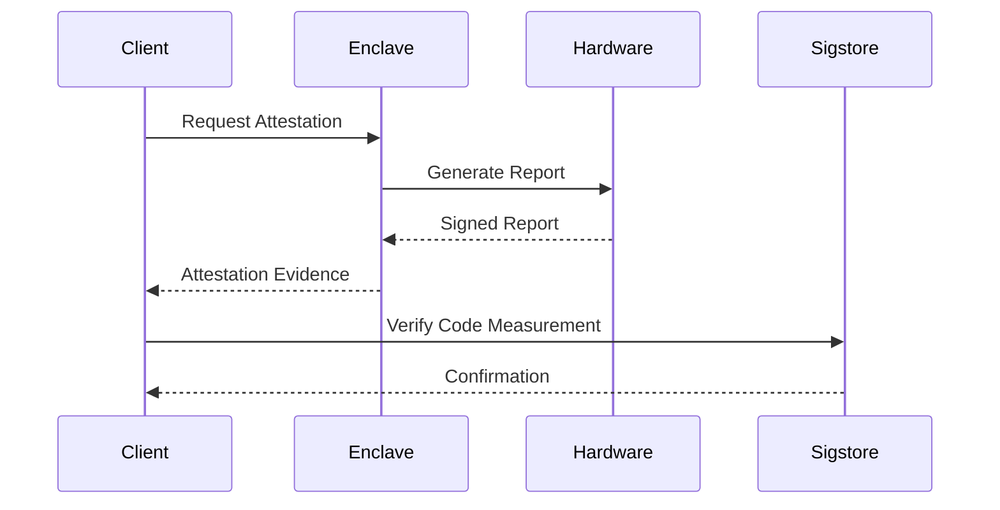

## Understanding Integrity

Tinfoil's integrity features ensure that your code and data remain unchanged and verifiable. Our TEEs provide powerful attestation capabilities that prove the authenticity and state of your secure environment.

<Note>
When users connect to your service, their devices automatically verify the Tinfoil Enclave's attestation proof through a series of cryptographic checks.
</Note>

## Attestation Process

### How It Works

<Steps>
  1. **Hardware Authentication**
     - Verify genuine NVIDIA, Intel, or AMD hardware
     - Validate secure boot sequence
     - Confirm hardware security features
  
  2. **Configuration Verification**
     - Check security settings
     - Validate memory encryption
     - Verify isolation parameters
  
  3. **Code Measurement**
     - Generate unique code identifiers
     - Verify against known good values
     - Prevent unauthorized modifications
  
  4. **Runtime Verification**
     - Continuous integrity monitoring
     - Real-time attestation checks
     - Automatic validation by clients
</Steps>

## Technical Implementation

### Attestation Flow



### Verification Components

<CardGroup cols={2}>
  <Card title="Hardware Root of Trust" icon="microchip">
    - Secure boot measurements
    - Hardware-based key storage
    - Cryptographic identity
  </Card>
  <Card title="Runtime Attestation" icon="shield-check">
    - Memory integrity checks
    - Code measurements
    - Configuration validation
  </Card>
  <Card title="Code Verification" icon="code">
    - Source code validation
    - Binary measurements
    - Build verification
  </Card>
  <Card title="Client Validation" icon="users">
    - Automatic verification
    - Cryptographic proofs
    - Real-time checking
  </Card>
</CardGroup>

## Integrity Guarantees

### What We Verify

<AccordionGroup>
  <Accordion icon="server" title="Hardware Platform">
    Confirms that your code is running on genuine, properly configured confidential computing hardware:
    - Authentic NVIDIA/Intel/AMD chips
    - Proper security configuration
    - Enabled protection features
  </Accordion>
  
  <Accordion icon="shield" title="Enclave Configuration">
    Validates the secure environment setup:
    - Memory encryption enabled
    - Proper isolation
    - Secure key management
  </Accordion>
  
  <Accordion icon="code" title="Application Code">
    Ensures your application code hasn't been modified:
    - Match against transparency log
    - Binary verification
    - Runtime measurements
  </Accordion>
</AccordionGroup>

## Verification Tools

### Built-in Verification

Tinfoil provides automated tools for integrity verification:

<CodeGroup>
```typescript Attestation Check
const verifyEnclave = async () => {
  // Get attestation from enclave
  const attestation = await enclave.getAttestation();
  
  // Verify hardware authenticity
  const hardwareValid = await verifyHardware(attestation);
  
  // Check code measurement
  const codeValid = await verifyCodeMeasurement(attestation);
  
  return hardwareValid && codeValid;
}
```

```typescript Code Verification
const verifyCode = async () => {
  // Fetch code measurement from transparency log
  const measurement = await fetchMeasurement();
  
  // Compare with running enclave
  const matches = await compareWithEnclave(measurement);
  
  return matches;
}
```
</CodeGroup>

## Best Practices

When implementing integrity verification:

<Steps>
  1. **Always Verify Attestation**
     - Check attestation before sending sensitive data
     - Implement automatic verification in clients
     - Monitor attestation status
  
  2. **Track Code Versions**
     - Maintain list of valid measurements
     - Update verification when deploying
     - Monitor transparency logs
  
  3. **Implement Monitoring**
     - Set up alerts for verification failures
     - Track attestation metrics
     - Monitor enclave health
  
  4. **Regular Audits**
     - Review attestation logs
     - Verify deployment procedures
     - Check configuration settings
</Steps>

## Next Steps

<CardGroup cols={2}>
  <Card
    title="Try the Demo"
    icon="play"
    href="https://tinfoil.sh/chat"
  >
    See integrity verification in action
  </Card>
  <Card
    title="Transparency"
    icon="eye"
    href="/features/transparency"
  >
    Learn about our code transparency features
  </Card>
</CardGroup>