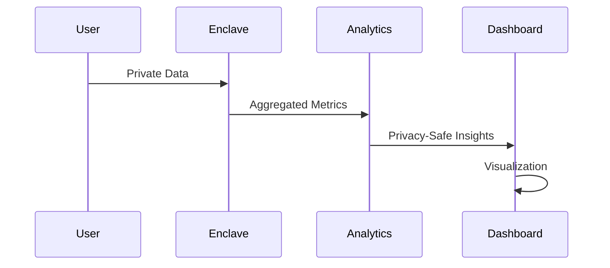

## Understanding Observability

Tinfoil's observability features allow you to monitor and debug your applications while maintaining complete privacy. Our integrated analytics platform ensures you can collect valuable insights without compromising user data security.

<Note>
Our private analytic platform guarantees that no individual private data can ever be exposed while enabling rich context-aware analytics.
</Note>

## Privacy-Preserving Analytics

### How It Works



### Key Features

<CardGroup cols={2}>
  <Card title="Secure Aggregation" icon="calculator">
    - Private data aggregation
    - Secure multi-party computation
    - Privacy thresholds
    - Statistical noise
  </Card>
  <Card title="Rich Metrics" icon="chart-line">
    - Usage patterns
    - Performance data
    - Error tracking
    - User behavior
  </Card>
  <Card title="Prometheus Compatible" icon="gauge">
    - Standard metrics format
    - Easy integration
    - Familiar tooling
    - Custom exporters
  </Card>
  <Card title="Privacy Guarantees" icon="lock">
    - No individual data exposure
    - Differential privacy
    - Secure computation
    - Access controls
  </Card>
</CardGroup>

## Implementation

### Setting Up Analytics

<CodeGroup>
```typescript Metrics Collection
import { TinfoilMetrics } from '@tinfoil/analytics';

const metrics = new TinfoilMetrics({
  service: 'my-app',
  privacy: {
    threshold: 5,
    noise: 0.1
  }
});

// Record metric
metrics.observe('request_duration', 123, {
  endpoint: '/api/process',
  status: 200
});
```

```yaml Prometheus Config
scrape_configs:
  - job_name: 'tinfoil-metrics'
    scrape_interval: 15s
    static_configs:
      - targets: ['localhost:9090']
    metrics_path: '/metrics'
    scheme: 'https'
    tls_config:
      ca_file: /path/to/ca.pem
```
</CodeGroup>

## Available Metrics

### System Metrics

<AccordionGroup>
  <Accordion icon="microchip" title="Resource Usage">
    Monitor system resource utilization:
    - CPU usage
    - Memory consumption
    - Network traffic
    - Storage usage
  </Accordion>
  
  <Accordion icon="gauge" title="Performance">
    Track performance metrics:
    - Request latency
    - Processing time
    - Queue length
    - Cache hit rates
  </Accordion>
  
  <Accordion icon="bug" title="Error Tracking">
    Monitor system health:
    - Error rates
    - Exception counts
    - Failure types
    - Recovery time
  </Accordion>
</AccordionGroup>

### Business Metrics

Collect aggregated insights about:
- User engagement
- Feature usage
- Processing volumes
- Service health

## Privacy Controls

### Privacy Mechanisms

<Steps>
  1. **Aggregation**
     - Combine individual data points
     - Apply privacy thresholds
     - Implement secure computation
  
  2. **Noise Addition**
     - Add statistical noise
     - Preserve data utility
     - Protect individual privacy
     
  3. **Access Control**
     - Role-based access
     - Audit logging
     - Data minimization
     
  4. **Data Lifecycle**
     - Retention policies
     - Secure deletion
     - Data aging
</Steps>

## Dashboard Integration

### Available Integrations

<CardGroup cols={3}>
  <Card title="Grafana" icon="chart-line">
    Rich visualization of secure metrics
  </Card>
  <Card title="Prometheus" icon="gauge">
    Standard metrics collection
  </Card>
  <Card title="Custom UI" icon="browser">
    Build custom dashboards
  </Card>
</CardGroup>

## Best Practices

### Implementing Observability

<AccordionGroup>
  <Accordion icon="list-check" title="Planning">
    Before implementation:
    - Define key metrics
    - Set privacy requirements
    - Plan data collection
    - Design aggregation strategy
  </Accordion>
  
  <Accordion icon="shield" title="Privacy">
    Ensure data protection:
    - Set appropriate thresholds
    - Configure noise parameters
    - Implement access controls
    - Review aggregation rules
  </Accordion>
  
  <Accordion icon="gauge" title="Monitoring">
    Regular maintenance:
    - Monitor metric health
    - Check privacy compliance
    - Audit access logs
    - Review dashboards
  </Accordion>
</AccordionGroup>

### Common Pitfalls

<Warning>
Avoid these observability mistakes:

- Collecting unnecessary data
- Insufficient privacy controls
- Missing aggregation thresholds
- Poor metric naming
</Warning>

## Next Steps

<CardGroup cols={2}>
  <Card
    title="API Reference"
    icon="code"
    href="/api-reference/introduction"
  >
    Explore our metrics API
  </Card>
  <Card
    title="Demo Dashboard"
    icon="chart-mixed"
    href="https://demo.tinfoil.sh/dashboard"
  >
    See privacy-preserving analytics in action
  </Card>
</CardGroup>